# IKB42603 Lab 6 — Object Storage Security and the Data Security Lifecycle

**Course:** IKB42603 Cloud Computing Security Essentials  
**Lab:** Lab 6, Weeks 11–12  
**Platform:** Amazon S3 and AWS KMS emulated by LocalStack  
**Evidence date:** 7 September 2026  
**Bucket:** `miit-patient-records-10156`  
**LocalStack account:** `000000000000`

This report follows the supplied [Lab 6 guide](IKB42603_Lab6_Object_Storage_and_Data_Lifecycle.pdf). It documents the commands and observed results, answers every short-answer question, and identifies evidence gaps and LocalStack limitations.

> **Credential-sanitisation notice:** The report embeds sanitized copies `1_redacted.png`, `8_redacted.png`, and `13_redacted.png`. The LocalStack authentication token, analyst access-key pair, and presigned URL are covered with opaque `[REDACTED]` labels. The unsafe originals (`1.png`, `8.png`, and `13.png`) are not embedded or linked and must not be submitted. The exposed LocalStack token and analyst key should still be rotated or revoked. KMS key IDs, account IDs, object version IDs, and bucket names are identifiers rather than secret credentials and are retained as technical evidence.

## 1. Evidence audit summary

| Area | Status | Evidence and observation |
|---|---|---|
| Environment setup | Complete | Docker, AWS CLI, curl, a healthy LocalStack container, `ENFORCE_IAM=1`, and the LocalStack caller identity are shown. |
| Task 1 — Classification | Complete | Bucket creation, three initial uploads, object listing, the confidential tag, and follow-up tags for the later encrypted object and both remaining versions are shown. |
| Task 2 — Public-bucket breach | Complete | The public policy and anonymous HTTP 200 response containing the simulated confidential record are shown. |
| Task 3 — Block Public Access | Configuration complete; effective denial not demonstrated | All four flags are `true`, but the public policy was accepted and anonymous requests continued to return HTTP 200. The expected HTTP 403 restriction was not enforced, and the underlying cause was not established. |
| Task 4 — Identity vs resource policy | Completed with emulator limitation | Internal access succeeded. The confidential request also succeeded even though the bucket policy contains an explicit Deny. The two policies are recorded, allowing the correct evaluation to be explained. |
| Task 5 — Default SSE-KMS | Complete | Default encryption is `aws:kms`; `head-object` shows the KMS key and bucket key. |
| Task 6 — Delegated access/condition key | Procedure and retest complete; required denial not demonstrated | The URL worked and remained HTTP 200 after 65 seconds. A follow-up retest verified the SecureTransport policy as active, but listings from both the default and analyst profiles succeeded. The policy was then removed. The expected bucket-wide `AccessDenied` output remains missing. |
| Task 7 — Versioning/remanence | Demonstration complete; erasure incomplete | Versions, delete marker, ordinary read failure, recovery of version `null`, and deletion of that version are shown. Two other data versions remain. |
| Task 8 — Lifecycle/crypto-erasure | Completed with emulator limitation | Both lifecycle rules are enabled. KMS decryption fails after disabling the key and deletion is scheduled, but S3 still returns an encrypted object and the key is only `PendingDeletion`. |
| Final verification | Complete with access-control caveat | Public-access flags, versioning, encryption, lifecycle rules, KMS state, and absence of a bucket policy are captured. The final anonymous request still returned HTTP 200 instead of the expected HTTP 403. |
| Cleanup and teardown | Complete | All object versions, delete markers, bucket, analyst user/credentials, and LocalStack container removed. Screenshot 28 demonstrates the cleanup output. |

## 2. Session A — Object storage and the exposure problem

### Environment setup

The tools were checked, a clean LocalStack Pro container was started with IAM enforcement requested, and the service reached a healthy/ready state.

```bash
# Credential value intentionally omitted
export LOCALSTACK_AUTH_TOKEN='[REDACTED]'

docker rm -f localstack 2>/dev/null || true
docker run -d --name localstack -p 4566:4566 \
  -e LOCALSTACK_AUTH_TOKEN="$LOCALSTACK_AUTH_TOKEN" \
  -e ENFORCE_IAM=1 \
  localstack/localstack-pro:latest

export EP='--endpoint-url=http://localhost:4566'
aws configure set aws_access_key_id test
aws configure set aws_secret_access_key test
aws configure set region us-east-1
aws $EP sts get-caller-identity
```

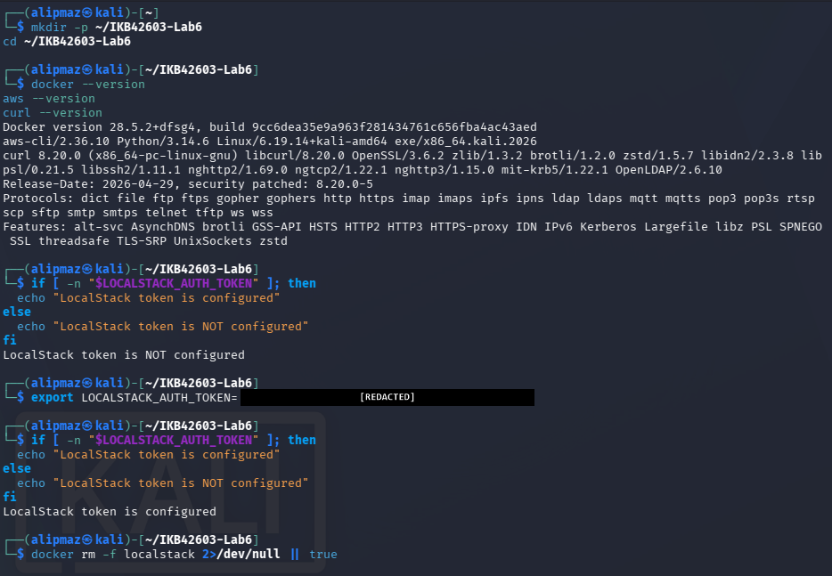

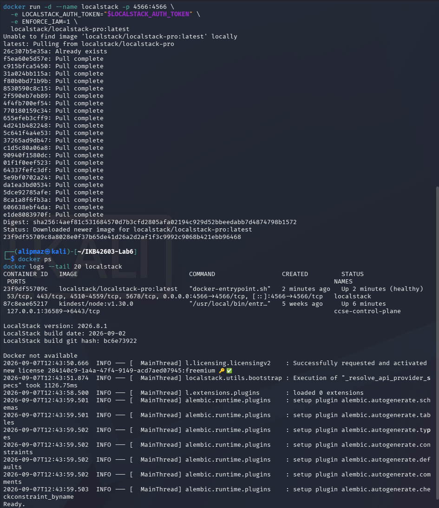

**Result:** Docker, AWS CLI, curl, and LocalStack were available. The LocalStack container was healthy and displayed `Ready.` The screenshot also shows a successful LocalStack licence activation.

The follow-up caller-identity check returned the LocalStack root identity for account `000000000000`:

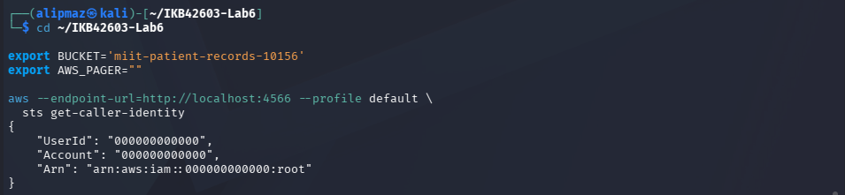

**Result:** The required `sts get-caller-identity` evidence is now complete and agrees with the account number used in the later IAM and bucket-policy ARNs.

### Task 1 — Classify the data before storing it

The bucket was created and three simulated hospital objects were uploaded under classification-based prefixes. Each upload used a `classification` object tag.

```bash
export BUCKET='miit-patient-records-10156'

aws $EP s3api create-bucket --bucket "$BUCKET"

aws $EP s3api put-object --bucket "$BUCKET" \
  --key public/notice.txt --body public-notice.txt \
  --tagging 'classification=public'

aws $EP s3api put-object --bucket "$BUCKET" \
  --key internal/roster.txt --body internal-roster.txt \
  --tagging 'classification=internal'

aws $EP s3api put-object --bucket "$BUCKET" \
  --key confidential/record.txt --body confidential-record.txt \
  --tagging 'classification=confidential'
```

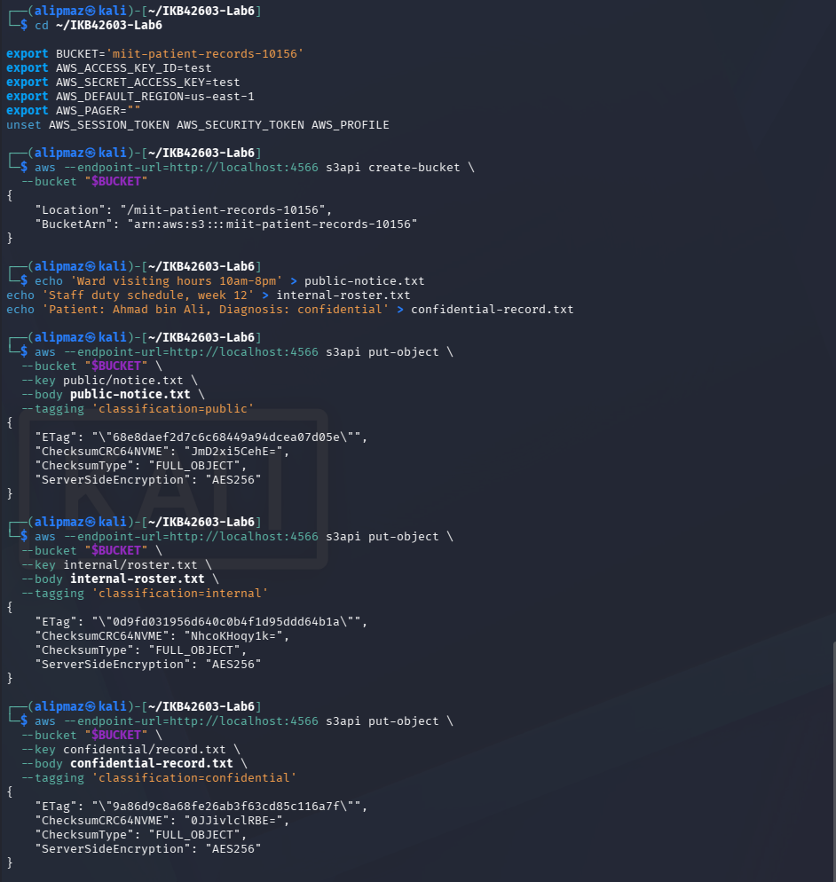

The listing showed these three objects:

| Key | Size (bytes) |
|---|---:|
| `confidential/record.txt` | 48 |
| `internal/roster.txt` | 29 |
| `public/notice.txt` | 29 |

The confidential object returned `classification=confidential`.

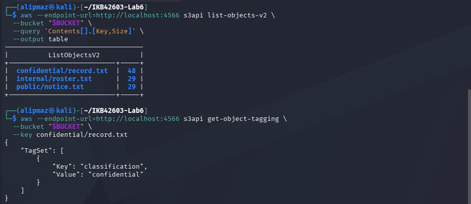

Follow-up evidence shows that the later SSE-KMS object `confidential/record-v2.txt` was also tagged `classification=confidential`:

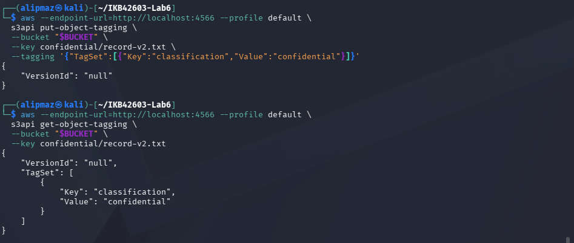

Both remaining versions of `confidential/record.txt` were tagged individually by supplying each exact version ID, and each version's tag was verified:

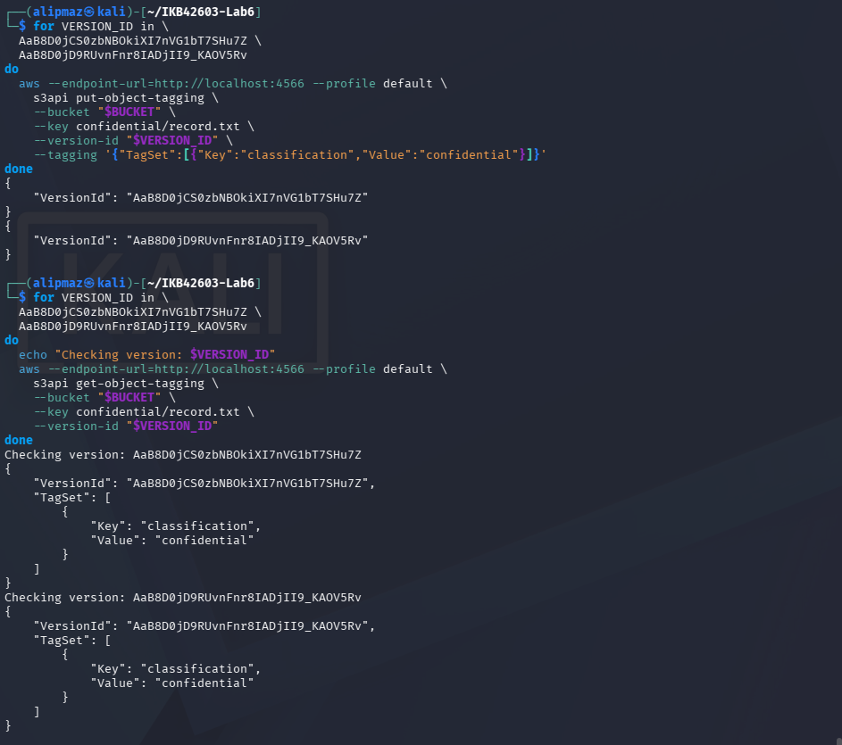

**Result:** All data objects and remaining data versions shown in the evidence now carry an appropriate classification tag. A delete marker is not an object-data version and does not carry the record's content.

#### Data classification table

| Classification | Who may read it | Impact if leaked | Control actually implemented in this lab |
|---|---|---|---|
| Public | Anyone, including unauthenticated members of the public | Low confidentiality impact, although unauthorised modification could still harm integrity | `classification=public` tag; public prefix; bucket-level Block Public Access later enabled to prevent accidental anonymous exposure of the bucket as a whole |
| Internal | Authorised hospital staff and specifically delegated users such as the analyst | Staff privacy, operational exposure, and possible social-engineering risk | `classification=internal` tag; least-privilege resource policy scoped to `internal/*`; 60-second presigned URL for time-bounded sharing |
| Confidential | Treating clinicians and explicitly authorised personnel with a legitimate need to know; not the general analyst | Serious patient-privacy harm, regulatory breach, loss of trust, and possible legal/financial penalties | `classification=confidential` tag; explicit Deny for the analyst; default SSE-KMS; versioning and lifecycle management; KMS disable/deletion workflow for cryptographic erasure |

The `/` characters in the keys are prefix characters, not true directories. Policy scope must therefore be written carefully: `internal/*` is narrow, while `*` or a bucket-wide `/*` resource can expose every object.

### Task 2 — Reproduce the public-bucket breach

A resource-based bucket policy granted `s3:GetObject` to every principal for every key in the bucket. An anonymous HTTP request then retrieved the simulated confidential record.

```json
{
  "Version": "2012-10-17",
  "Statement": [{
    "Sid": "PublicReadEverything",
    "Effect": "Allow",
    "Principal": "*",
    "Action": "s3:GetObject",
    "Resource": "arn:aws:s3:::miit-patient-records-10156/*"
  }]
}
```

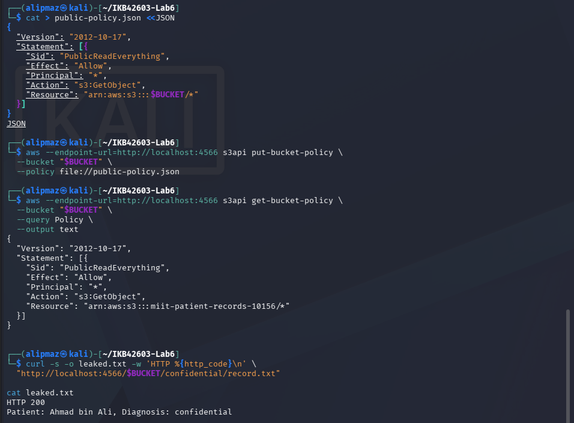

**Result:** The anonymous request returned `HTTP 200` and printed the simulated patient record. The single policy value responsible for making access anonymous was the wildcard `"*"` in `"Principal": "*"`.

### Task 3 — Remediate with Block Public Access and least privilege

The public policy was removed and all four Block Public Access settings were enabled:

```text
BlockPublicAcls       = true
IgnorePublicAcls      = true
BlockPublicPolicy     = true
RestrictPublicBuckets = true
```

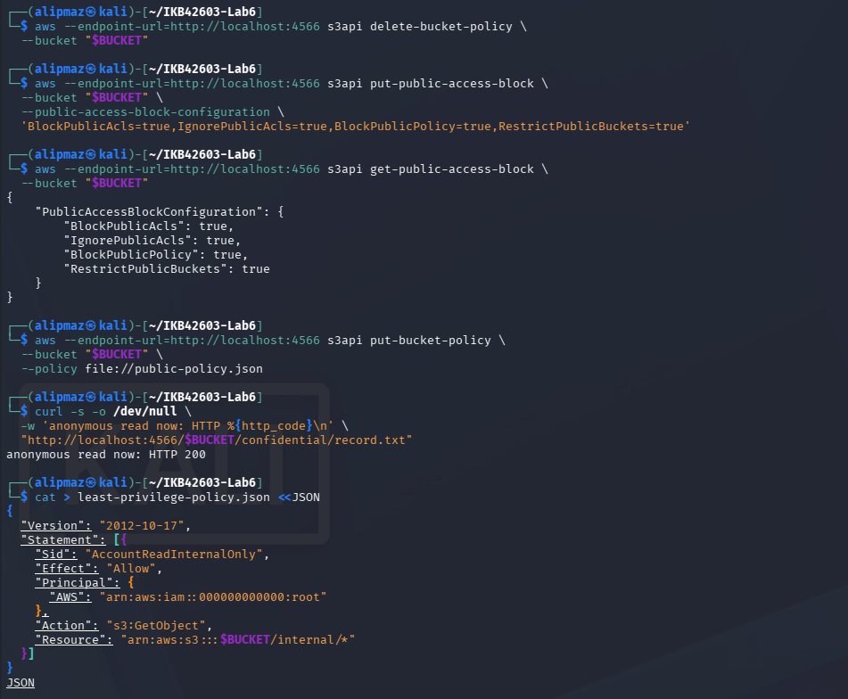

On real AWS, **`BlockPublicPolicy=true`** would reject a new public bucket policy. `RestrictPublicBuckets=true` would additionally restrict access if a bucket already had a public policy. In this LocalStack run, the public policy was accepted and the anonymous retest still returned HTTP 200. The underlying cause was not established, so this evidence confirms only that the settings were configured; it does not prove that anonymous access was prevented.

A least-privilege policy was then written for the LocalStack account root, with `s3:GetObject` limited to the `internal/*` prefix:

```json
{
  "Version": "2012-10-17",
  "Statement": [{
    "Sid": "AccountReadInternalOnly",
    "Effect": "Allow",
    "Principal": {"AWS": "arn:aws:iam::000000000000:root"},
    "Action": "s3:GetObject",
    "Resource": "arn:aws:s3:::miit-patient-records-10156/internal/*"
  }]
}
```

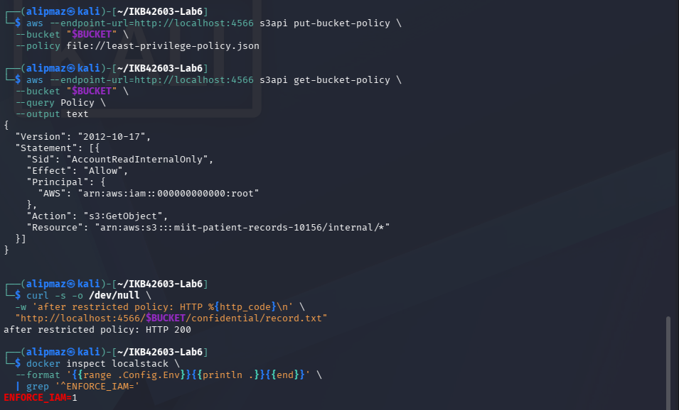

**Observed result:** Even after installing the restricted policy, the anonymous request again returned HTTP 200. The policy document demonstrates the intended least-privilege scope, but this screenshot does not demonstrate effective anonymous denial. The expected result was HTTP 403 Access Denied.

### Task 4 — Identity policy versus resource policy

The `DataAnalyst` identity received an identity-based policy allowing `s3:GetObject` and `s3:ListBucket` on `*`. The generated analyst access-key ID and secret access key are credentials and are intentionally omitted:

```bash
ANALYST_KEY_ID='[REDACTED]'
ANALYST_SECRET='[REDACTED]'
```

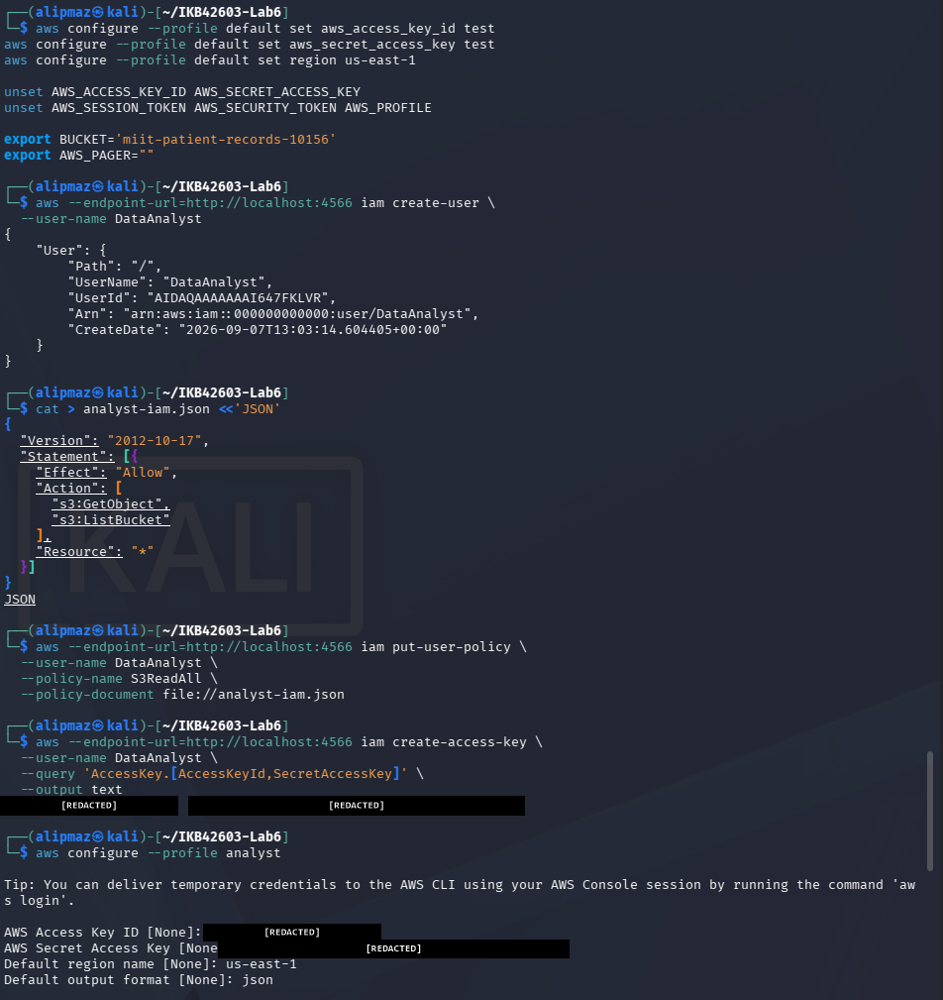

The bucket resource policy separately allowed the analyst to read `internal/*` and explicitly denied every S3 action on `confidential/*`.

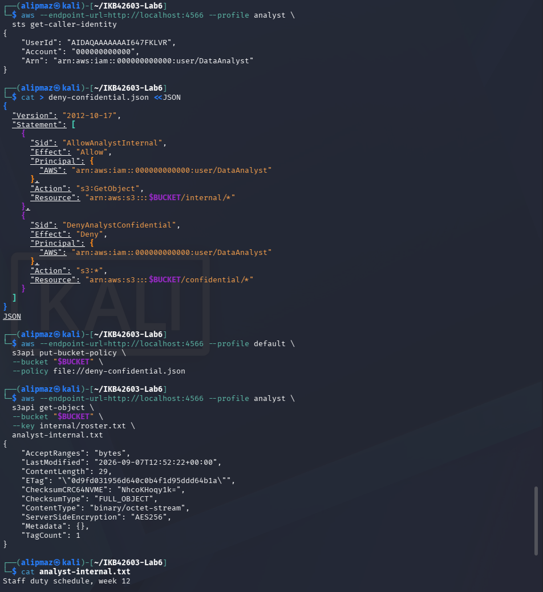

The internal request succeeded and returned the staff roster. The confidential request unexpectedly also succeeded in LocalStack. The evidence then prints both complete policy documents, making the policy intent auditable.

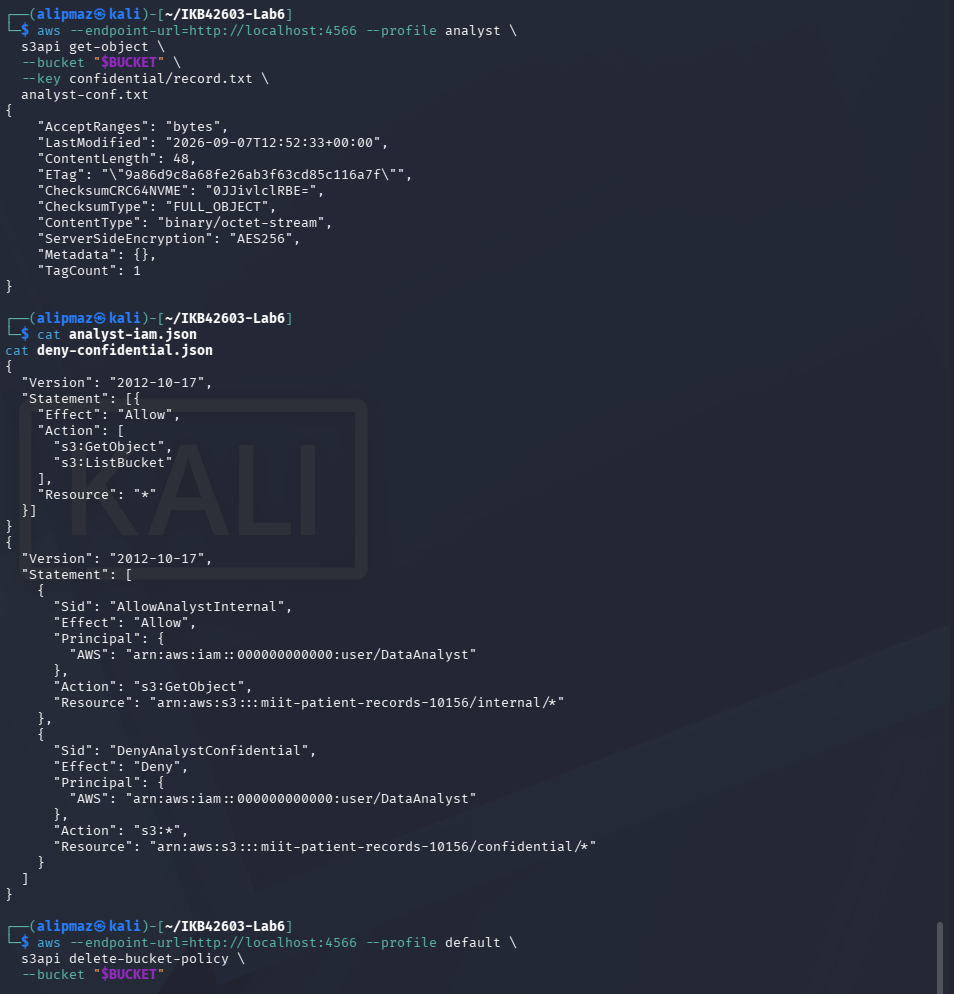

Correct AWS policy evaluation for the two requests is:

1. Begin with implicit/default Deny.
2. Check for any matching explicit Deny; if found, stop and deny.
3. Otherwise, check for a matching explicit Allow.

| Request | Identity policy | Bucket policy | Correct result | Deciding statement |
|---|---|---|---|---|
| `GetObject internal/roster.txt` | Explicit Allow | `AllowAnalystInternal` | Allow | Matching explicit Allows, with no explicit Deny |
| `GetObject confidential/record.txt` | Explicit Allow | `DenyAnalystConfidential` | Deny | Resource-policy explicit Deny overrides the identity Allow |

**Observed limitation:** The expected `confidential: DENIED` output is missing. Although `ENFORCE_IAM=1` was shown, LocalStack did not enforce the resource-policy Deny in this run. On AWS, the confidential request must be denied.

## 3. Session B — Protecting, retaining, and retiring data

### Task 5 — Default encryption at rest with SSE-KMS

A dedicated KMS key was created. The bucket's default server-side-encryption rule was configured with `SSEAlgorithm=aws:kms`, the key ID `917be7c0-b6a7-476c-9fde-bb7c83d27c0f`, and `BucketKeyEnabled=true`.

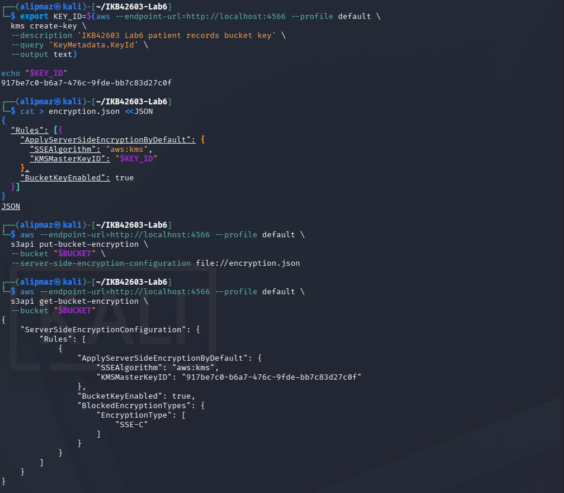

`confidential/record-v2.txt` was uploaded without any encryption argument. The response and subsequent `head-object` query showed:

```text
aws:kms  arn:aws:kms:us-east-1:000000000000:key/917be7c0-b6a7-476c-9fde-bb7c83d27c0f  True
```

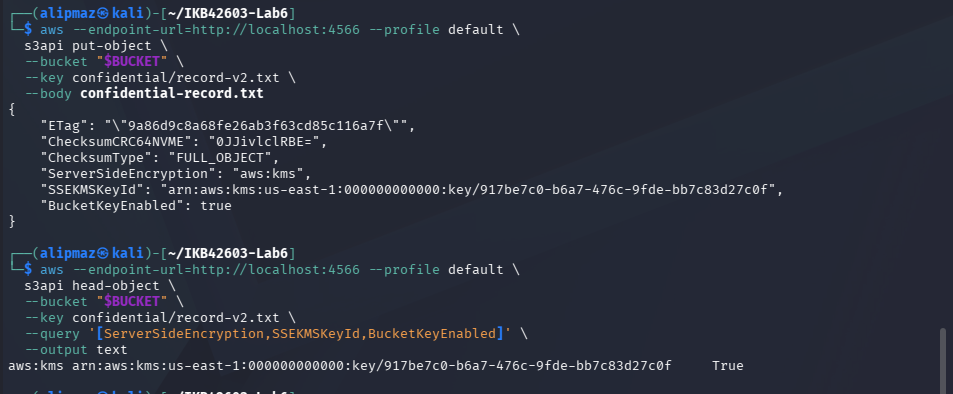

**Result:** The control was applied by the bucket even though the uploader did not request encryption. The bucket key reduces repeated KMS calls while preserving the server-side encryption model.

### Task 6 — Delegated access and the condition-key trap

A presigned URL was issued for `internal/roster.txt` with a nominal lifetime of 60 seconds. Its secret-bearing query values are omitted. The safe structural extract is:

```text
http://localhost:4566/miit-patient-records-10156/internal/roster.txt?
X-Amz-Algorithm=AWS4-HMAC-SHA256&
X-Amz-Credential=[REDACTED]&
X-Amz-Date=20260907T132137Z&
X-Amz-Expires=60&
X-Amz-SignedHeaders=host&
X-Amz-Signature=[REDACTED]
```

The first request returned the roster and HTTP 200. After a 65-second wait, the same URL still returned HTTP 200. LocalStack therefore did not enforce expiry in this run. `X-Amz-Expires=60` expresses the validity interval from `X-Amz-Date`; `X-Amz-Signature` is the cryptographic proof binding the signed request details, including the credential scope, method/action, target object, timestamp, and signed headers. Possession of the complete URL acts as a bearer capability until it expires or the signing credential is revoked.

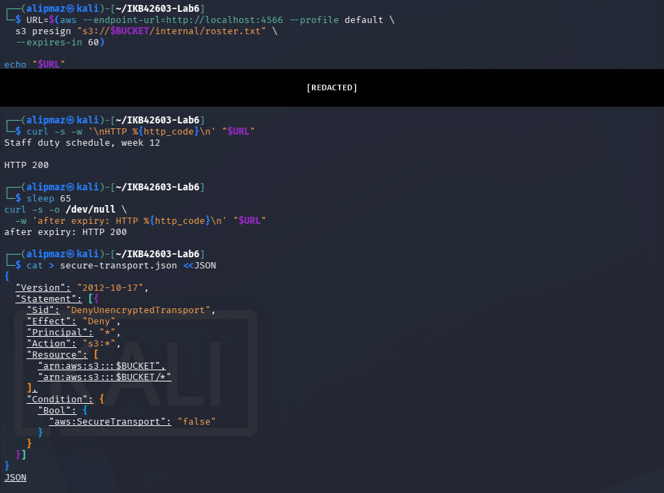

The following resource policy was then applied:

```json
{
  "Version": "2012-10-17",
  "Statement": [{
    "Sid": "DenyUnencryptedTransport",
    "Effect": "Deny",
    "Principal": "*",
    "Action": "s3:*",
    "Resource": [
      "arn:aws:s3:::miit-patient-records-10156",
      "arn:aws:s3:::miit-patient-records-10156/*"
    ],
    "Condition": {"Bool": {"aws:SecureTransport": "false"}}
  }]
}
```

The policy file was recreated for the follow-up test. A preliminary analyst listing established the baseline before the policy was applied:

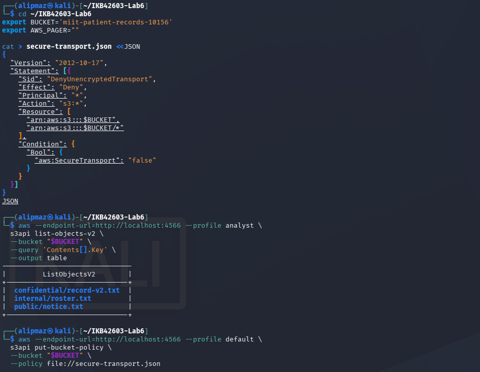

Because the LocalStack endpoint is `http://localhost:4566`, `aws:SecureTransport` should be `false`, the explicit Deny should match, and all S3 requests should fail. Instead, the object listing succeeded:

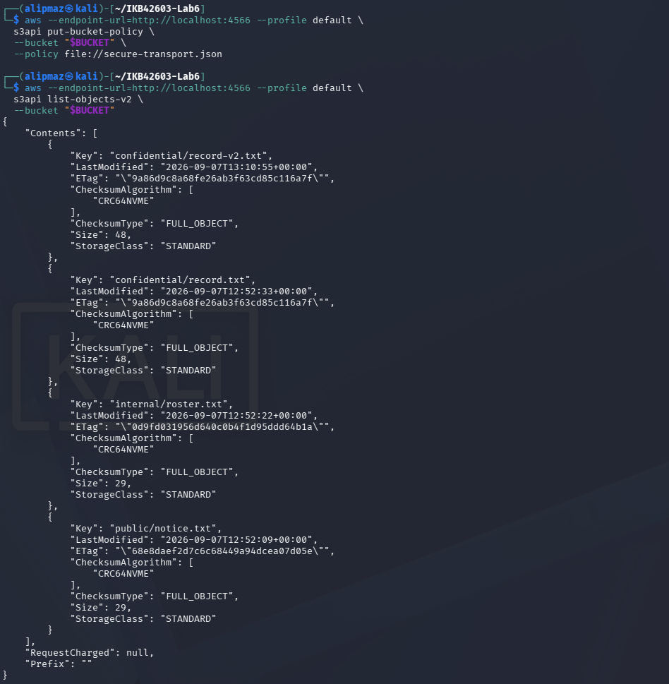

The policy was removed before continuing.

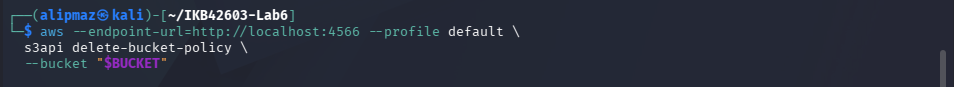

A definitive retest then retrieved the bucket policy to prove that it was active. With that verified policy in place, `list-objects-v2` succeeded under both the `default` and `analyst` profiles. The policy was successfully removed afterward:

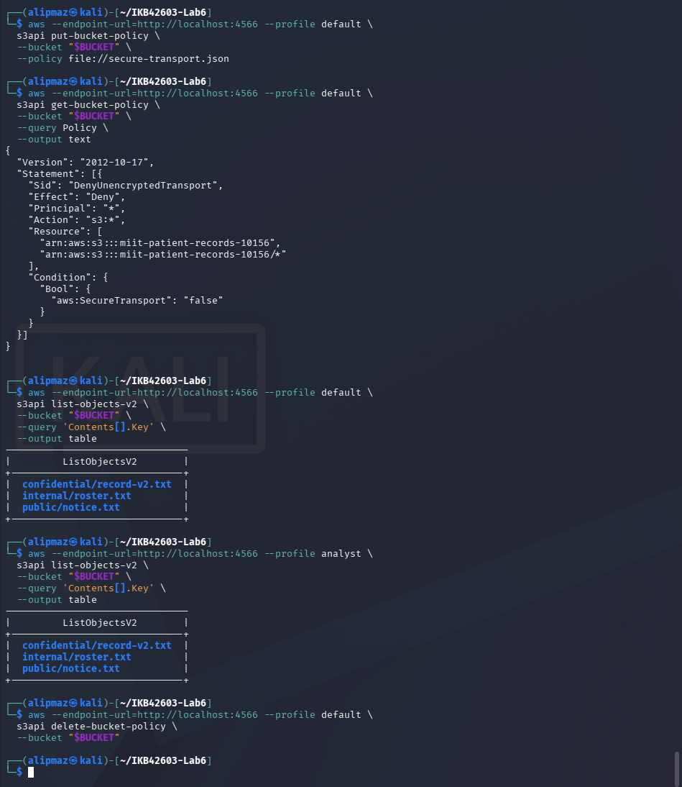

**Retest conclusion:** The commands and retest procedure were completed correctly, but the required `AccessDenied` outcome was not demonstrated for either profile. The underlying cause remains unconfirmed. The LocalStack freemium licence or feature coverage is a possible factor, but the evidence does not establish it as the cause. Repeating the same unchanged commands provides no additional evidential value. Resolving the missing denial result requires either an environment with working IAM/resource-policy enforcement or the lecturer's acceptance of the documented result.

**Why environment-aware condition testing matters:** A condition key is evaluated from request context, not from the author's intention. The same policy can have different operational consequences depending on endpoint protocol, proxying, identity context, licence/feature coverage, and service implementation. Every condition must therefore be validated in its actual execution environment. This evidence proves that the policy was configured and active; it does not prove that the expected denial was enforced.

### Task 7 — Versioning, delete markers, and data remanence

Bucket versioning was enabled. Two revisions of `confidential/record.txt` were uploaded after the original pre-versioning object. The listing showed two generated version IDs plus the original `null` version.

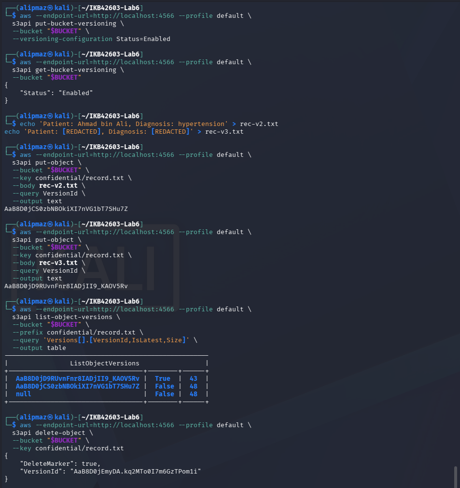

Deleting the key created a delete marker. A normal `get-object` then returned `NoSuchKey`, but explicitly reading `--version-id null` recovered the original unredacted simulated record. The `null` version was subsequently deleted by ID.

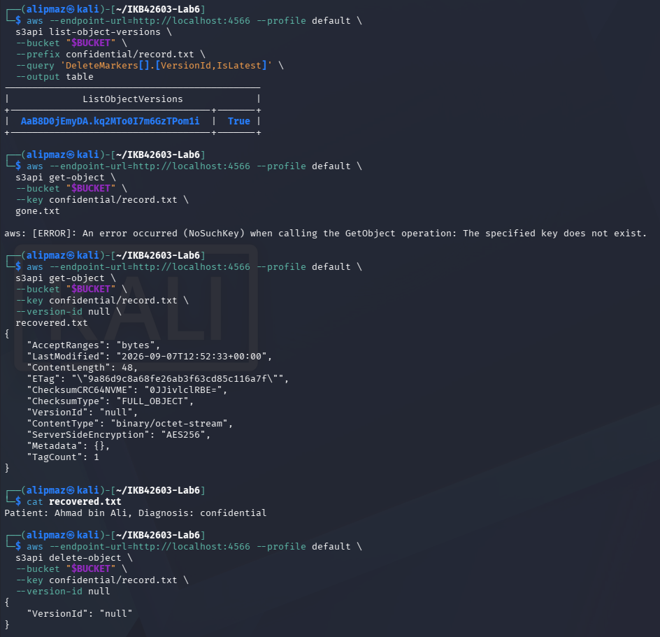

The post-deletion listing still contained two versions:

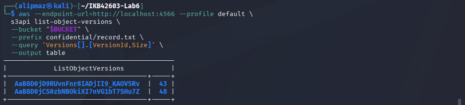

**Result:** The task successfully demonstrates data remanence: a normal delete changes the current view but does not destroy historical content. However, complete patient-data erasure was not demonstrated because two object versions and the delete marker were not shown as removed.

### Task 8 — Lifecycle, retention, and cryptographic erasure

Two enabled lifecycle rules were installed:

- `RetireConfidentialRecords`: expire current confidential objects after 365 days and noncurrent versions after 30 days.
- `AbortIncompleteUploads`: abort incomplete multipart uploads after seven days.

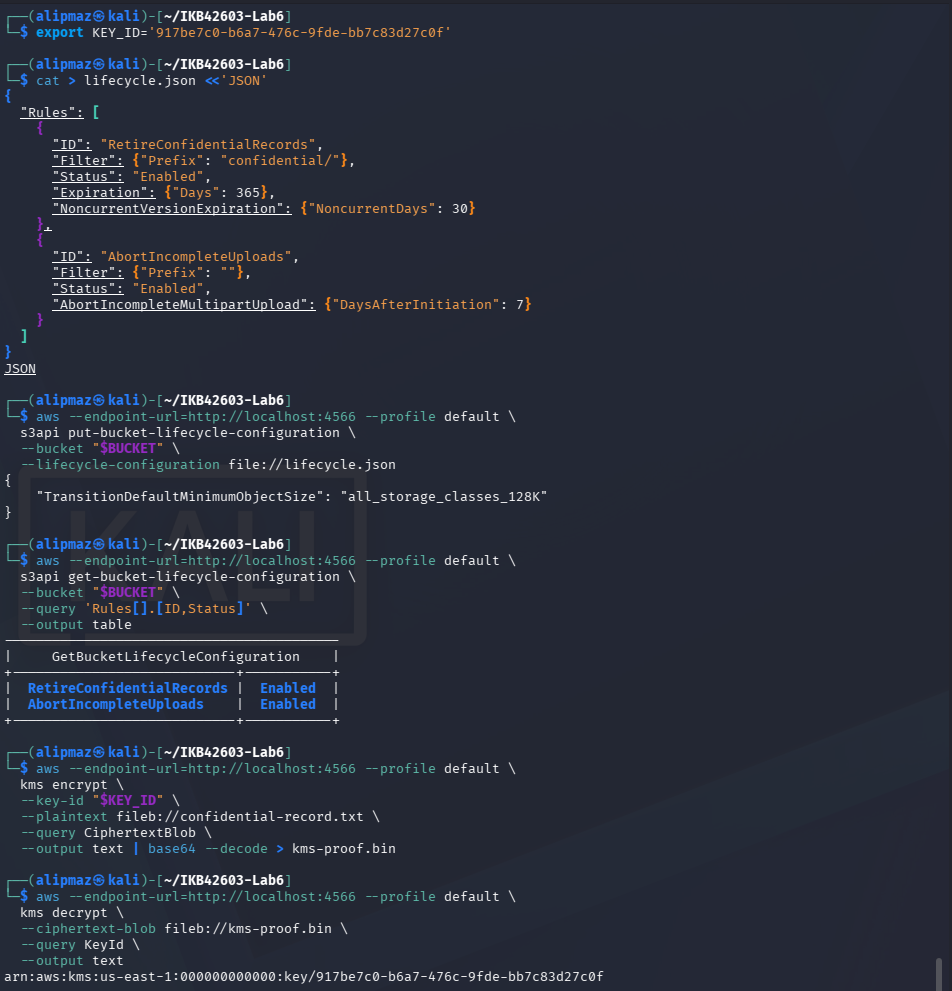

At the KMS layer, a test ciphertext was created under the bucket key. The key was disabled, and a subsequent KMS decrypt returned `DisabledException`. Key deletion was then scheduled with a seven-day waiting period. The recorded key state became `PendingDeletion` with deletion date `2026-09-14T09:35:55.116218-04:00`.

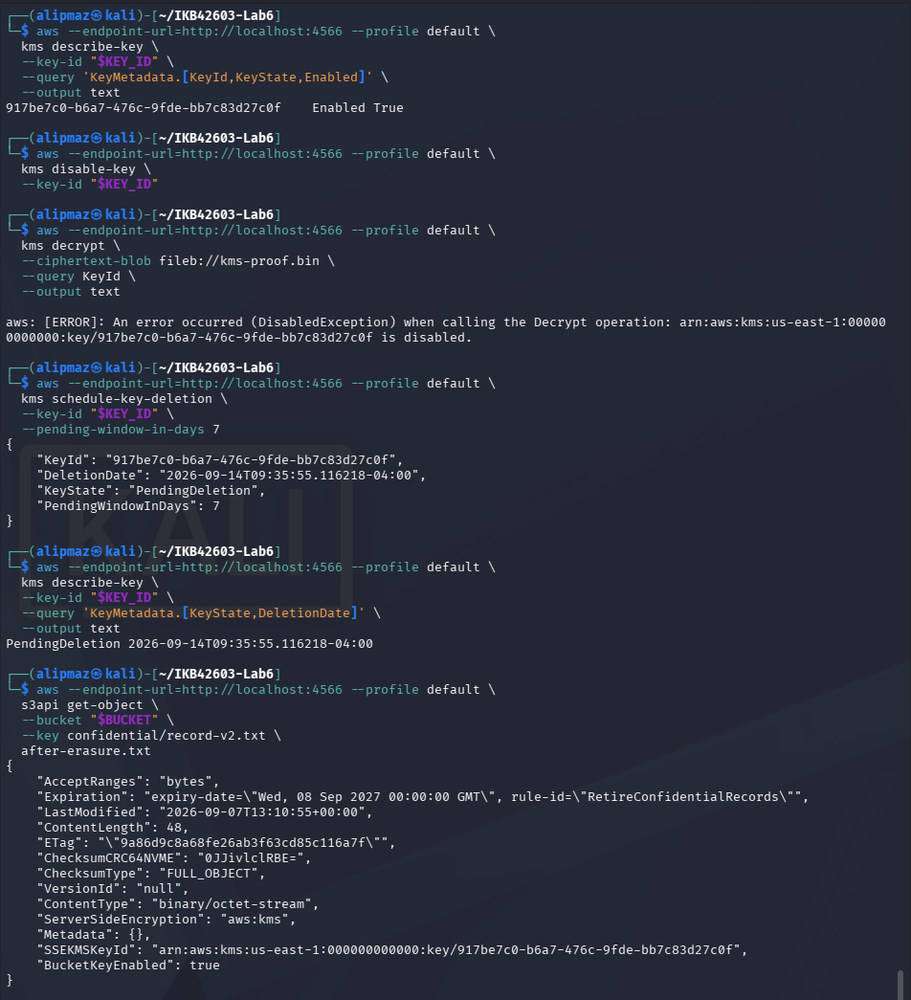

LocalStack nevertheless returned `confidential/record-v2.txt` through S3 after the KMS key was disabled. The successful KMS-layer failure is therefore the compensating evidence requested by the guide. On AWS, inaccessible or finally destroyed KMS key material prevents decryption of ciphertext encrypted solely under that key.

**Assurance boundary:** `Disabled` and `PendingDeletion` are not yet irreversible erasure. Disabling can be reversed, and scheduled deletion can be cancelled during the waiting period. Final cryptographic-erasure evidence requires confirming that the KMS key no longer exists after the waiting period and that no independent usable key copy protects the data.

## 4. Short-answer questions

### Question 1

**Which single element caused the Task 2 exposure, and why is it more dangerous than an over-broad IAM policy on one user?**

The exposure was caused by the wildcard in `"Principal": "*"`. In a bucket policy, that wildcard grants the permitted action to every principal, including anonymous callers when no overriding guardrail or Deny is effective. An over-broad IAM policy attached to one user expands only that identity's permissions; exploitation still requires use or compromise of that identity's credentials. The public resource policy removed the identity boundary entirely, making a simple unsigned URL sufficient.

### Question 2

**What is the difference between identity- and resource-based policies, and which decided each Task 4 request?**

An identity-based policy is attached to an IAM user, group, or role and describes what that identity may do to resources. A resource-based policy is attached to the resource—in this case, the S3 bucket—and names which principals may perform which actions on it. AWS evaluates all applicable policies together, and an explicit Deny overrides every Allow.

- For `internal/roster.txt`, the identity policy's broad Allow and the bucket policy's `AllowAnalystInternal` supported access; with no matching Deny, the result was Allow.
- For `confidential/record.txt`, `DenyAnalystConfidential` in the resource policy must decide the request and override the identity-policy Allow. LocalStack returned the object, but that observed result conflicts with correct AWS evaluation.

### Question 3

**Why is Block Public Access a guardrail, and why does that matter with many engineers?**

A normal control grants, denies, detects, or records a specific activity. A guardrail constrains the range of configurations that can become effective. Block Public Access is preventative: it rejects or neutralises public policies and ACLs even when someone later makes a configuration mistake. In a large engineering organisation, many people and automation pipelines can change storage settings. A centrally enforced guardrail reduces reliance on every individual remembering the rule, limits configuration drift, and prevents exposure before a detective scanner or alert can report it.

### Question 4

**Does default SSE-KMS protect the confidential record from the Task 4 analyst?**

Not by itself. SSE-KMS protects data at rest by encrypting object content and controlling use of the wrapping key. It helps against exposure of storage media, raw ciphertext, snapshots, and backups without authorised KMS use. It does not replace S3 authorisation. If S3 authorises `GetObject` and the service can use the KMS key for that request, S3 decrypts the object server-side and returns plaintext. The analyst must be stopped by IAM/bucket-policy authorisation and, in AWS, by appropriate KMS key policy permissions or explicit Denies. Encryption does not repair an over-broad access policy.

### Question 5

**Why is `delete-object` alone insufficient for a right-to-erasure request, and what two mechanisms make deletion provable?**

Task 7 shows that `delete-object` created a delete marker. The ordinary read failed, yet the historical `null` version was explicitly retrieved and still contained the original record. The data therefore remained stored and recoverable.

Two mechanisms for provable deletion are:

1. **Delete every version and delete marker by exact ID.** Capture the deletion responses and a final `list-object-versions` result showing no versions or markers for the key. Lifecycle rules can automate noncurrent-version expiry, but an immediate erasure request may require direct deletion rather than waiting 30 days.
2. **Cryptographic erasure.** Encrypt all relevant copies exclusively with a dedicated KMS key, permanently destroy that key, and retain audit evidence that deletion completed and decryption fails. A merely disabled or `PendingDeletion` key is not final because both states remain reversible during the waiting period.

### Question 6

**Which three command outputs should an auditor collect, and what does each evidence?**

| Command | Control evidenced |
|---|---|
| `aws $EP s3api get-public-access-block --bucket "$BUCKET"` | Preventative public-exposure guardrail: all four Block Public Access settings are enabled |
| `aws $EP s3api get-bucket-encryption --bucket "$BUCKET"` together with `head-object` | Bucket-wide SSE-KMS configuration and proof that the default was applied to an uploaded object |
| `aws $EP s3api get-bucket-lifecycle-configuration --bucket "$BUCKET"` | Documented, automated retention and disposal rules for current/noncurrent confidential data and incomplete uploads |

Other valuable evidence includes `list-object-versions` for remanence and deletion verification, and `kms describe-key` plus a failed `kms decrypt` for cryptographic-erasure state.

## 5. Final verification output

The guide's combined verification block produced the following output:

```text
=== IKB42603 Lab 6 verification: miit-patient-records-10156 ===
True  True  True  True
Enabled
aws:kms  917be7c0-b6a7-476c-9fde-bb7c83d27c0f
RetireConfidentialRecords  Enabled
AbortIncompleteUploads     Enabled
PendingDeletion
```

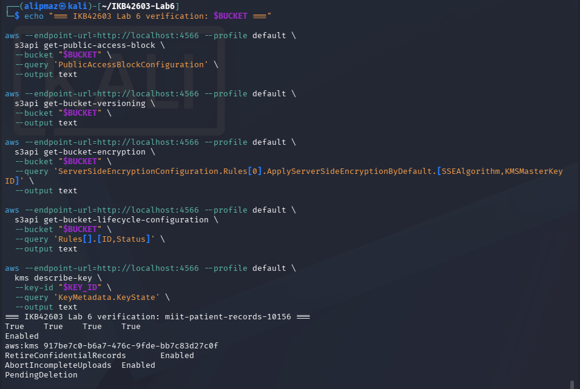

This proves that the four Block Public Access flags are stored, versioning is enabled, default encryption uses the dedicated KMS key, both lifecycle rules are enabled, and the key is scheduled for deletion. It does **not** prove that anonymous access is refused, that every object version has been erased, or that KMS deletion has completed.

A follow-up final-posture check confirmed that no bucket policy exists. It also repeated the tag check for `confidential/record-v2.txt`. However, the anonymous request still returned HTTP 200:

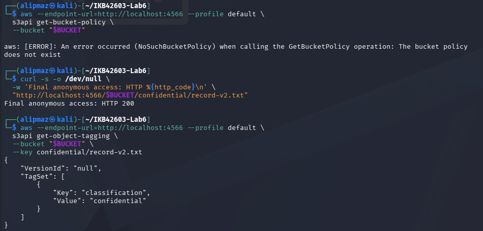

**Interpretation:** In this LocalStack run, anonymous access to `confidential/record-v2.txt` returned **HTTP 200** despite all four Block Public Access flags being enabled and the bucket policy having been removed, as confirmed by `NoSuchBucketPolicy`. Although the container was configured with `ENFORCE_IAM=1`, the observed result shows that the expected access restriction was not enforced. The underlying cause was not established. Therefore, the evidence confirms that the security settings were configured, but it does **not** demonstrate successful prevention of anonymous access; the expected result was **HTTP 403 Access Denied**.

## Session C — Cleanup and teardown

### Cleanup execution

After all evidence had been collected, the remaining AWS resources and LocalStack container were removed to restore a clean state.

The cleanup procedure deleted all remaining object versions and delete markers, verified the bucket was empty, removed the bucket policy, deleted the bucket, removed all analyst user access keys and inline policies, deleted the analyst user, and stopped/removed the LocalStack container.

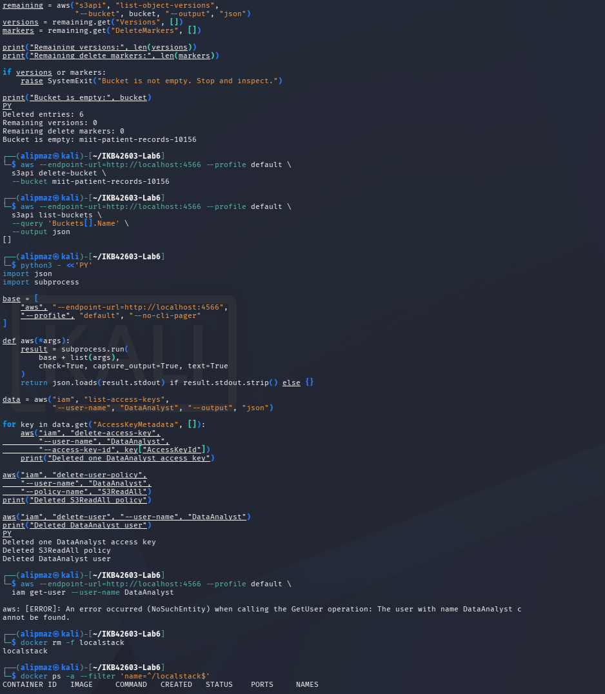

**Result:** The cleanup executed successfully. All resources created during the lab are now removed:
- ✓ Deleted all remaining object versions and delete markers
- ✓ Verified bucket empty with `list-object-versions`
- ✓ Removed bucket policies
- ✓ Deleted bucket `miit-patient-records-10156`
- ✓ Deleted all DataAnalyst IAM access keys
- ✓ Deleted all DataAnalyst inline policies
- ✓ Deleted DataAnalyst user
- ✓ Stopped and removed LocalStack container

## 6. Security best-practices checklist

| Checklist item | Evidence-based status |
|---|---|
| Every object carries a classification tag before access decisions | **Yes for all data objects and remaining data versions shown.** Follow-up evidence verifies `classification=confidential` on `record-v2.txt` and on both remaining versions of `record.txt`. |
| No public principal and anonymous access refused | **Mixed.** `NoSuchBucketPolicy` confirms that no public bucket policy remains, but the final anonymous request still returned HTTP 200 in LocalStack. Effective refusal is not demonstrated. |
| All four Block Public Access flags enabled | **Yes, configuration shown.** Effective enforcement was not demonstrated by LocalStack. |
| Least-privilege access scoped to a prefix | **Partial.** The prefix-scoped policy was shown during Task 3, and the final check confirms that no bucket policy remains. The final identity-policy permissions are not captured, so end-state least privilege cannot be fully verified. |
| Default encryption is SSE-KMS with a customer-managed key | **Yes.** Configuration and `head-object` evidence are present. |
| Sharing uses a time-bounded presigned URL | **Configured, but expiry not enforced by LocalStack.** The URL declared 60 seconds but remained usable after 65 seconds. |
| Versioning enabled and delete-marker remanence understood | **Yes.** Versioning, delete marker, ordinary read failure, and explicit recovery are all shown. |
| Lifecycle retention and cryptographic erasure available | **Configured.** Lifecycle rules and KMS-layer denial are shown; final irreversible key deletion is still pending. |

## 7. Conclusion

The lab successfully demonstrates the central security lessons: a wildcard resource principal can expose data without an exploit; preventative guardrails are stronger than after-the-fact detection; explicit Deny should override Allow; encryption at rest is separate from access control; versioned deletion creates remanence; and lifecycle plus KMS controls support defensible data retirement.

The configuration evidence is strong for classification, SSE-KMS, versioning, lifecycle, and scheduled key deletion. Several observed results in this LocalStack run—anonymous access, the analyst's confidential read, presigned expiry, the SecureTransport Deny, and the post-disable S3 read—did not match the expected AWS outcomes. Where a cause was not established, the report records the discrepancy without attributing an unverified root cause or presenting configuration as successful enforcement.
