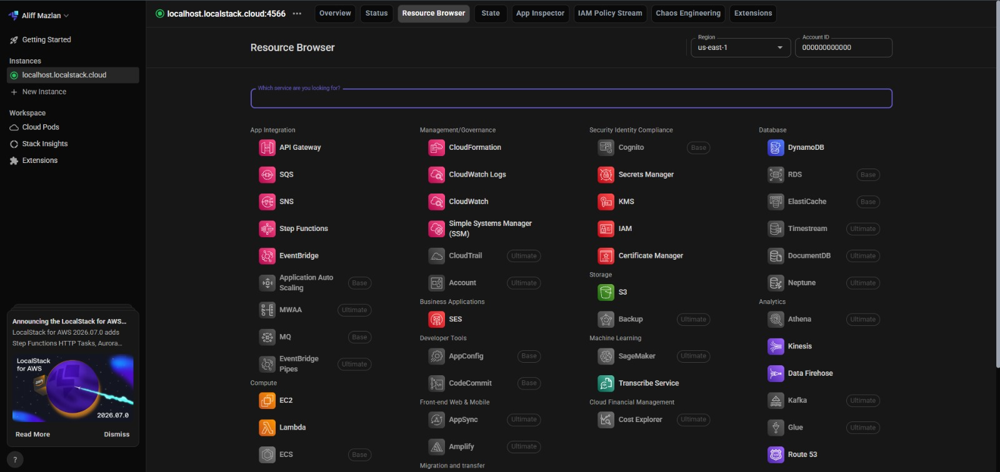

# Lab 0: Environment Setup Report

| Item | Details |
|---|---|
| Course | IKB42603 Cloud Computing Security Essentials |
| Lab | Lab 0 — Environment Setup |
| Reference | IKB42603_Lab0_Environment_Setup_Cheatsheet.pdf |
| Platform shown in evidence | Kali Linux |
| Evidence location | Project root images in the workspace |

> Confidentiality notice: personal usernames are not reproduced in the report. The AWS identity shown below is LocalStack's documented dummy identity, not a real AWS credential. No password, private key, session token, MFA seed, or real AWS access key is included.

## 1. Objective

The purpose of Lab 0 was to prepare the local lab environment so the later labs could run without a real AWS account. The guide required the installation and verification of Docker, AWS CLI v2, kind, kubectl, OpenSSL, oathtool, and LocalStack, followed by a local Kubernetes cluster test.

## 2. Evidence reviewed

The following evidence files were available in the workspace root:

- 
- 
- 
- 
- 
- 
- 
- 
- 
- 

## 3. Step-by-step report

### Step 1 — Install and verify Docker

The guide instructed the user to install Docker and then verify it with:

```bash
docker --version
docker run --rm hello-world
```

Evidence: 

Observed result:
- Docker version was reported as 28.5.2+dfsg4.
- The hello-world container completed successfully.

Outcome: Passed.

### Step 2 — Install and verify AWS CLI v2

The guide required AWS CLI v2 to be installed and verified with:

```bash
aws --version
```

Evidence: 

Observed result:
- AWS CLI version 2.36.10 was reported.

Outcome: Passed.

### Step 3 — Install and verify kind

The guide required kind to be installed and verified with:

```bash
kind --version
```

Evidence: 

Observed result:
- kind v0.23.0 was reported.

Outcome: Passed.

### Step 4 — Install and verify kubectl

The guide required kubectl to be installed and verified with:

```bash
kubectl version --client
```

Evidence: 

Observed result:
- kubectl client version v1.36.3 was reported.
- Kustomize v5.8.1 was also reported.

Outcome: Passed.

### Step 5 — Verify helper tools

The guide listed OpenSSL and oathtool as required helper tools. The verification commands were:

```bash
openssl version
oathtool --version
```

Evidence:
- 
- 

Observed result:
- OpenSSL 3.6.3 was reported.
- OATH Toolkit 2.6.14 was reported.

Outcome: Passed.

### Step 6 — Start and verify LocalStack

The guide instructed the user to start LocalStack with:

```bash
docker run -d --name localstack -p 4566:4566 localstack/localstack
curl http://localhost:4566/_localstack/health
```

Evidence:
- 
- 

Observed result:
- The LocalStack container image was pulled and started.
- The LocalStack local web interface was reachable on localhost port 4566.

Outcome: Passed.

### Step 7 — Configure AWS CLI for LocalStack

The guide used dummy credentials and a temporary endpoint variable:

```bash
aws configure set aws_access_key_id test
aws configure set aws_secret_access_key test
aws configure set region us-east-1
EP='--endpoint-url=http://localhost:4566'
aws $EP sts get-caller-identity
```

Evidence: 

Observed result:
- The AWS CLI successfully communicated with LocalStack.
- The response returned a local dummy identity.

Outcome: Passed.

### Step 8 — Create and verify the Kubernetes cluster

The guide required a local kind cluster to be created and inspected with:

```bash
kind create cluster --name ccse
kubectl cluster-info --context kind-ccse
kubectl get nodes
```

Evidence: 

Observed result:
- A kind cluster named ccse was created.
- The control-plane node appeared in the Ready state.

Outcome: Passed.

## 4. Pre-lab verification checklist

The guide's checklist was completed as follows:

- [x] Docker version could be verified.
- [x] Docker hello-world container ran successfully.
- [x] AWS CLI v2 version was verified.
- [x] kind version was verified.
- [x] kubectl client version was verified.
- [x] LocalStack started and was reachable locally.
- [x] AWS CLI successfully connected to LocalStack.
- [x] A Kubernetes cluster was created and the node was ready.
- [x] OpenSSL and oathtool were available.

## 5. Conclusion

The Lab 0 environment was successfully prepared according to the guide. Docker, AWS CLI v2, kind, kubectl, OpenSSL, oathtool, LocalStack, and a local Kubernetes cluster were all verified using the supplied evidence images. The setup is suitable for the later labs.
