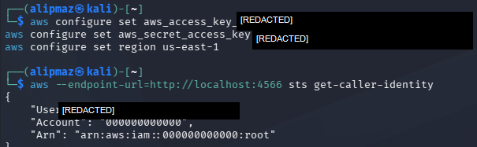
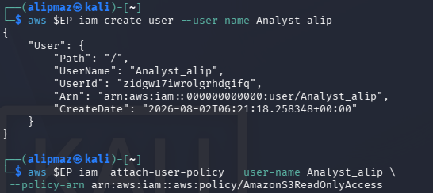
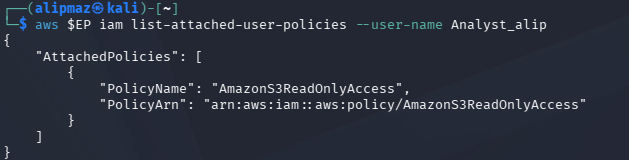
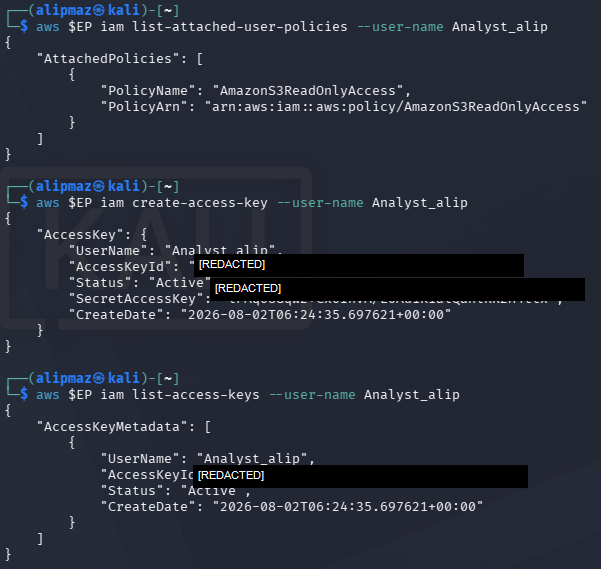
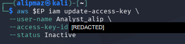

# IKB42603 Lab 1: Account Security and Identity & Access Management

**Lab:** Cloud Account Security, Identity & Access Management  
**Environment:** LocalStack IAM and Kubernetes RBAC  
**Date performed:** 2 August 2026  
**Student identifier used in the lab:** `alip`  
**Security note:** Credentials, access-key IDs, secret access keys, and unique identity IDs are omitted or displayed as `[REDACTED]`. Original evidence files are not reproduced where they expose credentials.

## 1. Objectives

This lab demonstrates secure cloud identity management through least privilege, group-based permission management, credential rotation, and Kubernetes role-based access control (RBAC). LocalStack simulates AWS IAM locally, while Kubernetes enforces authorization boundaries between the `dev` and `prod` namespaces.

## 2. Task 1 — Map the Cloud Identity Landscape

| Concept | AWS term | Purpose |
|---|---|---|
| All-powerful owner | Root user | The original account identity with unrestricted control over all account resources, billing, and security settings. It should be reserved for exceptional account-level tasks and protected with MFA. |
| Human/app identity | IAM User | A persistent identity representing a person or application. It can authenticate using a console password or access keys and receives permissions from policies or groups. |
| Permission bundle | IAM Policy | A JSON permission document that defines which actions are allowed or denied on specified resources, optionally subject to conditions. |
| Collection of users | IAM Group | A manageable collection of IAM users. Policies attached to the group are inherited by all members. |
| Temporary identity | IAM Role | An assumable identity that provides temporary credentials and permissions without requiring a permanent password or long-lived access key. |

## 3. Session A — LocalStack IAM

### 3.1 Verify Docker and start LocalStack

Docker was confirmed as installed:

```text
Docker version 28.5.2+dfsg4, build 9cc6dea...
```


LocalStack was started and its health endpoint returned the emulated services as `available`, including IAM, STS, and S3.

```bash
docker start localstack
curl http://localhost:4566/_localstack/health
```


### 3.2 Configure the AWS CLI and verify the operating identity

The AWS CLI was configured with LocalStack-only dummy credentials and the `us-east-1` region. The STS response confirmed that the commands were initially executed as the simulated root identity. No real AWS account was contacted.

```text
UserId:  [REDACTED]
Account: 000000000000
Arn:     arn:aws:iam::000000000000:root
```



### 3.3 Task 2 — Create a least-privilege administrator

An `Admins` group was created and the AWS-managed `AdministratorAccess` policy was attached to the group. A dedicated user named `CloudAdmin_alip` was created and added to the group. This avoids using the root identity for routine administration and allows permissions to be managed centrally.

```bash
aws $EP iam create-group --group-name Admins
aws $EP iam attach-group-policy --group-name Admins \
  --policy-arn arn:aws:iam::aws:policy/AdministratorAccess
aws $EP iam create-user --user-name CloudAdmin_alip
aws $EP iam add-user-to-group --group-name Admins \
  --user-name CloudAdmin_alip
aws $EP iam get-group --group-name Admins
```


The verification output showed `CloudAdmin_alip` as a member of `Admins`. Unique user and group IDs have been omitted from this report.


### 3.4 Task 3 — Enforce least privilege with a scoped policy

The user `Analyst_alip` was created and assigned only the AWS-managed `AmazonS3ReadOnlyAccess` policy.

```bash
aws $EP iam create-user --user-name Analyst_alip
aws $EP iam attach-user-policy --user-name Analyst_alip \
  --policy-arn arn:aws:iam::aws:policy/AmazonS3ReadOnlyAccess
aws $EP iam list-attached-user-policies --user-name Analyst_alip
```



The verification output contained one attached policy:

```text
PolicyName: AmazonS3ReadOnlyAccess
PolicyArn:  arn:aws:iam::aws:policy/AmazonS3ReadOnlyAccess
```



If this Analyst identity were compromised, the attacker would inherit only its limited S3 read permissions. The attacker would not receive administrative capabilities to create identities, change policies, or modify and delete resources outside the granted scope. This reduces the **blast radius**: fewer actions and resources are exposed, so the potential damage is substantially smaller than for a compromised administrator.

### 3.5 Task 4 — Credential hygiene and access-key rotation

An access key was created for `Analyst_alip`, listed to confirm its initial `Active` state, and then changed to `Inactive` to demonstrate rotation/revocation.

```text
UserName:        Analyst_alip
AccessKeyId:     [REDACTED]
SecretAccessKey: [REDACTED]
Initial status:  Active
Final status:    Inactive
```



```bash
aws $EP iam update-access-key --user-name Analyst_alip \
  --access-key-id [REDACTED] --status Inactive
```



Long-lived keys increase risk because they remain usable until explicitly disabled or deleted. If copied from a device, shell history, log, or repository, an attacker may retain access for a long time. Real deployments should prefer short-lived role credentials, store secrets securely, rotate keys, and never create root access keys or commit credentials to source control.

## 4. Session B — Kubernetes RBAC

### 4.1 Create and verify the local cluster

A local kind cluster named `ccse-lab1` was created. `kubectl cluster-info` confirmed that the control plane and CoreDNS were running, and `kubectl get nodes` showed `ccse-lab1-control-plane` in the `Ready` state.


### 4.2 Task 5 — Separate environments with namespaces

The `dev` and `prod` namespaces were created and both appeared as `Active`.

```bash
kubectl create namespace dev
kubectl create namespace prod
kubectl get namespaces
```


Namespaces provide logical separation within the same cluster and allow namespaced RBAC rules to restrict access to a specific environment.

### 4.3 Task 6 — Define and bind a least-privilege role

A `dev-user` service account was created in `dev`. The namespaced `pod-reader` Role grants only `get`, `list`, and `watch` on pods. The `dev-user-binding` RoleBinding assigns that Role to the service account.

```bash
kubectl create serviceaccount dev-user -n dev
kubectl create role pod-reader -n dev \
  --verb=get,list,watch --resource=pods
kubectl create rolebinding dev-user-binding -n dev \
  --role=pod-reader --serviceaccount=dev:dev-user
```


### 4.4 Task 7 — Test that access control works

The authorization checks produced the required results:

| Test | Result | Interpretation |
|---|---:|---|
| List pods in `dev` | `yes` | Allowed by `pod-reader`. |
| Delete pods in `dev` | `no` | Denied because `delete` is not one of the granted verbs. |
| List pods in `prod` | `no` | Denied because the Role and RoleBinding are scoped only to `dev`. |


The service account identifies, or authenticates, the requester as `system:serviceaccount:dev:dev-user`. Kubernetes then performs authorization against the applicable RBAC rules. Authorization permits `list pods` in `dev`, but blocks deletion because that verb is absent and blocks access to `prod` because the namespaced RoleBinding does not apply there.

## 5. Verification Command

The required command was run:

```bash
kubectl get rolebinding dev-user-binding -n dev -o yaml
```

Redacted output:

```yaml
apiVersion: rbac.authorization.k8s.io/v1
kind: RoleBinding
metadata:
  creationTimestamp: "2026-08-02T06:34:18Z"
  name: dev-user-binding
  namespace: dev
  resourceVersion: "844"
  uid: "[REDACTED]"
roleRef:
  apiGroup: rbac.authorization.k8s.io
  kind: Role
  name: pod-reader
subjects:
  - kind: ServiceAccount
    name: dev-user
    namespace: dev
```


This verifies that `dev-user-binding` refers to the `pod-reader` Role and binds it to `dev-user` in the `dev` namespace.

## 6. Short-Answer Questions

### Q1. Why is attaching policies to groups better than attaching them directly to users?

Groups centralize permission management. Administrators can update one group policy and apply the change consistently to every member, reducing duplicated configuration, accidental differences, and audit effort. Users can be granted or removed from a job function simply by changing group membership.

### Q2. What is the difference between an IAM User and an IAM Role?

An IAM User is a persistent identity for a person or application and may have long-lived credentials such as a password or access key. An IAM Role is an assumable identity with a defined permission set; it normally issues temporary credentials to trusted users, applications, or services and does not have permanent credentials of its own.

### Q3. Explain least privilege using the Analyst account, and how it reduces blast radius if compromised.

Least privilege means granting only the permissions necessary for the assigned task. `Analyst_alip` received only `AmazonS3ReadOnlyAccess`, so it can inspect S3 data but cannot administer IAM or modify resources. If compromised, the attacker is constrained to that narrow permission set, limiting the number of affected resources and actions—the compromise's blast radius.

### Q4. In Kubernetes, what is the difference between a Role and a RoleBinding?

A Role defines allowed operations on resources within a namespace. A RoleBinding assigns that Role to subjects such as users, groups, or service accounts. In this lab, `pod-reader` defines the pod-reading permissions, while `dev-user-binding` grants those permissions to `dev-user` in `dev`.

### Q5. Why did the developer service account fail to access prod, and which security principle does that demonstrate?

The service account failed because its Role and RoleBinding are namespaced to `dev`; no authorization rule grants it access in `prod`. This demonstrates least privilege and environment separation: access is limited to the exact namespace and operations required.

## 7. Security Best-Practices Checklist

- [x] Root is not used for routine tasks; a dedicated `CloudAdmin_alip` identity exists.
- [x] Administrative permissions are granted through the `Admins` group.
- [x] A least-privilege read-only identity, `Analyst_alip`, was created and verified.
- [x] An access key was listed and deactivated to demonstrate rotation.
- [x] Kubernetes RBAC permits pod reading in `dev` while denying deletion and cross-namespace access.
- [x] Credentials and secret values are redacted from the report.

## 8. Conclusion

The lab successfully replaced routine root use with a dedicated group-managed administrator, restricted an Analyst identity to read-only access, demonstrated access-key deactivation, and enforced least privilege with Kubernetes RBAC. The `yes / no / no` authorization results prove that the developer service account can perform its required read operation in `dev` but cannot delete pods or cross the `prod` boundary.
