# Terraform + LocalStack IAM Lab Report

## Student Information

| Field | Details |
| --- | --- |
| Name | MUHAMMAD ALIFF BIN MAZLAN |
| Student ID | 52215124172 |
| Class | L02-B04 |
| Module | IKB42603 - Cloud Computing Security Essentials |

## Lab Objective

This lab recreates IAM resources as Infrastructure as Code using Terraform and LocalStack. The required deployment creates the `Admins-1` group and `CloudAdmin_Aliff` user, attaches the AWS-managed `AdministratorAccess` policy to the group, adds the user to the group, verifies the result independently with the AWS CLI, proves idempotency, and removes the resources safely.

## Security and Redaction Notice

No LocalStack Auth Token, real AWS access key, real AWS secret key, password, or private code is included in this report. Credential values in commands and configuration are replaced with `[REDACTED]`. The Auth Token was entered with hidden terminal input and is not visible in the evidence.

The AWS values used by LocalStack are dummy placeholders rather than production credentials, but they are still hidden here because this report may be shared. Non-secret LocalStack resource identifiers, names, ARNs, timestamps, and container IDs may remain visible because they cannot authenticate to an account.

The original combined CLI screenshot contains visible dummy credential placeholders. This report uses the non-destructive redacted copy instead:

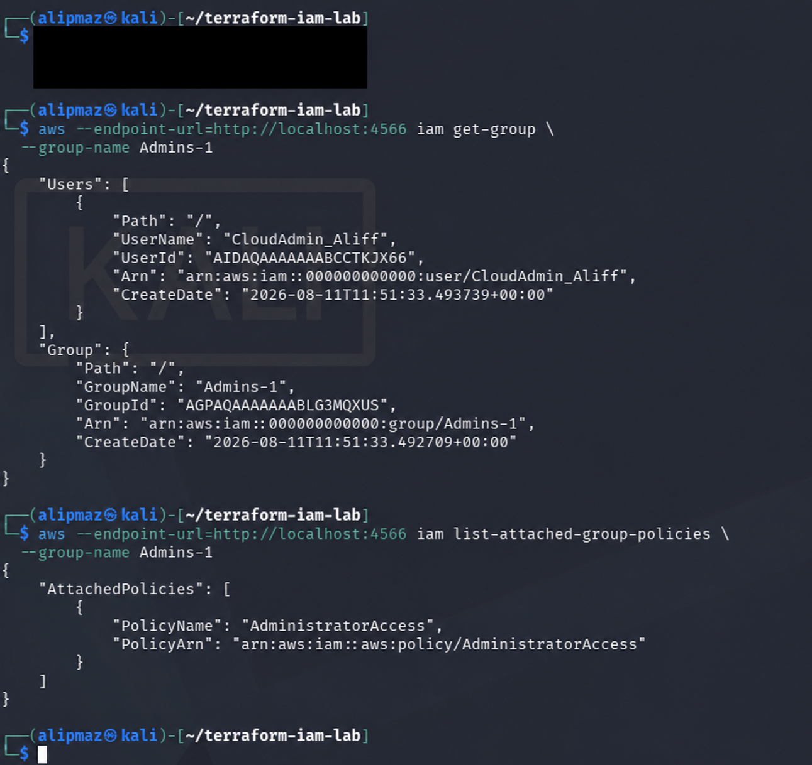

## Required Architecture

| Terraform resource | Required value | Purpose |
| --- | --- | --- |
| `aws_iam_group` | `Admins-1` | Central permission assignment |
| `aws_iam_user` | `CloudAdmin_Aliff` | Named IAM identity |
| `aws_iam_group_policy_attachment` | `AdministratorAccess` | Attaches administrator permissions to the group |
| `aws_iam_user_group_membership` | `CloudAdmin_Aliff` to `Admins-1` | Makes the user inherit group permissions |
| AWS provider endpoint | `http://localhost:4566` | Sends AWS-style API calls to LocalStack |

## Step-by-Step Procedure and Evidence

### Step 1: Install and confirm Terraform

Terraform was installed from the HashiCorp APT repository and checked with:

```bash
terraform --version
```

The evidence displays Terraform `v1.6.3-dev`. The update notice only reports that a newer release exists; it does not indicate installation failure.

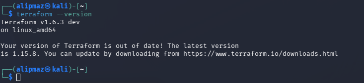

**Status:** Complete.

### Step 2: Check AWS CLI and Docker prerequisites

The following commands confirmed that the AWS CLI and Docker were available:

```bash
aws --version
docker --version
docker ps
```

The screenshot shows AWS CLI `2.36.10`, Docker `28.5.2+dfsg4`, and an existing KIND control-plane container. The guide states that the KIND container can continue running when port `4566` is available.

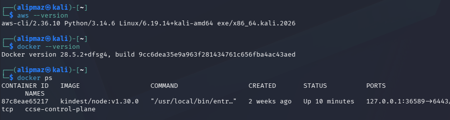

**Status:** Complete.

### Step 3: Load the LocalStack Auth Token securely

The Auth Token was read silently into an environment variable:

```bash
read -s "LOCALSTACK_AUTH_TOKEN?Paste token, then press Enter: "
echo
[[ -n "$LOCALSTACK_AUTH_TOKEN" ]] && echo "Token loaded" || echo "Token missing"
```

The evidence shows only `Token loaded`; the secret value itself is not displayed.

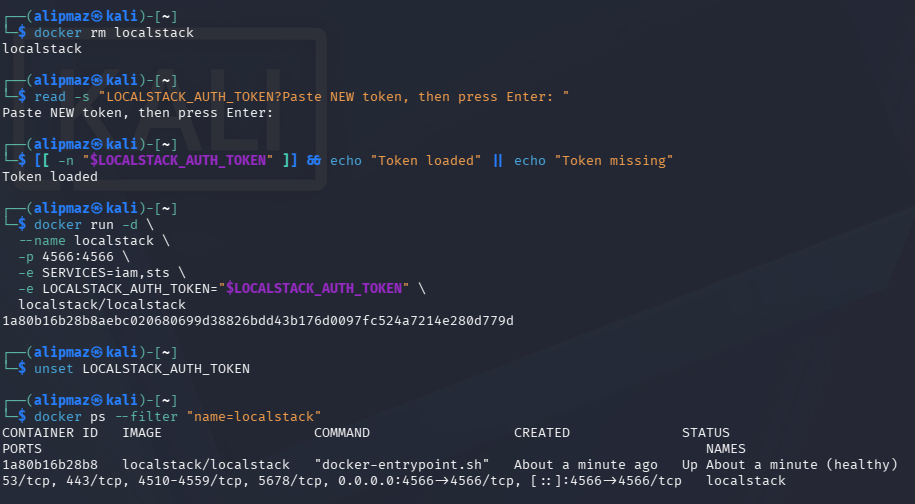

**Status:** Complete and safely redacted.

### Step 4: Start LocalStack

The named LocalStack container was started with the IAM and STS services. The report intentionally omits the secret value:

```bash
docker rm -f localstack
docker run -d \
  --name localstack \
  -p 4566:4566 \
  -e SERVICES=iam,sts \
  -e LOCALSTACK_AUTH_TOKEN="$LOCALSTACK_AUTH_TOKEN" \
  localstack/localstack
unset LOCALSTACK_AUTH_TOKEN
docker ps --filter "name=localstack"
```

The output shows the `localstack` container as `Up` and `healthy`, with host port `4566` mapped to container port `4566`. The token was removed from the shell after Docker received it.


**Status:** Complete.

### Step 5: Prepare the Terraform workspace

The guide requires a dedicated workspace:

```bash
mkdir -p ~/terraform-iam-lab
mv ~/Downloads/main.tf ~/terraform-iam-lab/
cd ~/terraform-iam-lab
ls -l
```

The terminal prompts in later screenshots confirm that Terraform was run from `~/terraform-iam-lab`.

> **Missing output:** No screenshot shows the required `ls -l` output proving that `main.tf` was present in that directory.

**Status:** Partially evidenced.

### Step 6: Configure and confirm `main.tf`

The configuration screenshot shows the LocalStack IAM and STS endpoints and all four required resource blocks. It also shows the correct deployed names, `Admins-1` and `CloudAdmin_Aliff`.

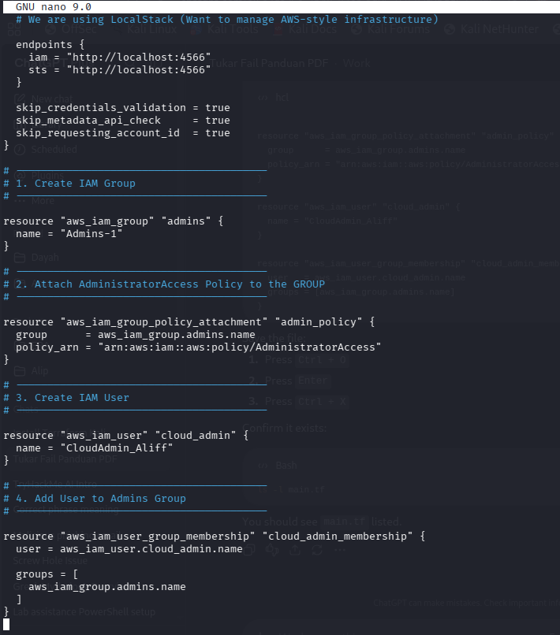

The credential fields are censored in this report:

```hcl
terraform {
  required_providers {
    aws = {
      source = "hashicorp/aws"
    }
  }
}

provider "aws" {
  access_key = "[REDACTED_LOCALSTACK_DUMMY_VALUE]"
  secret_key = "[REDACTED_LOCALSTACK_DUMMY_VALUE]"
  region     = "us-east-1"

  endpoints {
    iam = "http://localhost:4566"
    sts = "http://localhost:4566"
  }

  skip_credentials_validation = true
  skip_metadata_api_check     = true
  skip_requesting_account_id  = true
}

resource "aws_iam_group" "admins" {
  name = "Admins-1"
}

resource "aws_iam_group_policy_attachment" "admin_policy" {
  group      = aws_iam_group.admins.name
  policy_arn = "arn:aws:iam::aws:policy/AdministratorAccess"
}

resource "aws_iam_user" "cloud_admin" {
  name = "CloudAdmin_Aliff"
}

resource "aws_iam_user_group_membership" "cloud_admin_membership" {
  user   = aws_iam_user.cloud_admin.name
  groups = [aws_iam_group.admins.name]
}
```

The `AdministratorAccess` policy is attached to the group, not directly to the user. `CloudAdmin_Aliff` receives the permission through membership in `Admins-1`.

> **Required correction:** There is no `main.tf` in the current `terraform` submission folder. A nearby file at `C:\Users\ADMIN\Desktop\main.tf` currently declares `CloudAdmin_Ainin`, which does not match the guide or the successful deployment evidence. Before submission, copy the actual tested configuration into this folder and confirm that it declares `CloudAdmin_Aliff`.

> **Partial picture:** The editor screenshot starts partway through the provider configuration, so it does not show the entire file from the opening `terraform` block. The required source file itself is the better deliverable.

**Status:** Deployment configuration is evidenced, but the required source-file deliverable is missing/non-matching.

### Step 7: Initialize Terraform

The AWS provider was initialized with:

```bash
terraform init
```

The evidence contains `Terraform has been successfully initialized!` and shows AWS provider `v6.58.0` loaded from the dependency lock file.

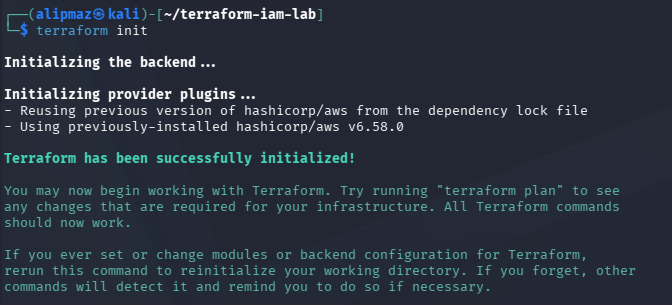

**Status:** Complete.

### Step 8: Format and validate

The configuration was formatted and validated:

```bash
terraform fmt
terraform validate
```

The output reports `Success! The configuration is valid.` No output from `terraform fmt` is normal when no filename needs to be reported.

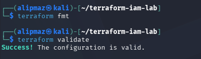

**Status:** Complete.

### Step 9: Review the initial plan

The proposed changes were reviewed before deployment:

```bash
terraform plan
```

Terraform proposed the four required resources and displayed `Plan: 4 to add, 0 to change, 0 to destroy.`

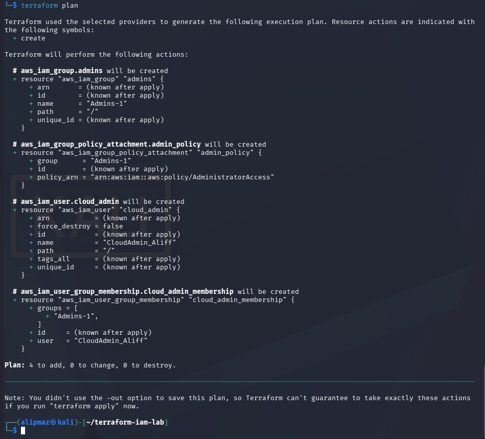

**Status:** Complete.

### Step 10: Apply the configuration

The reviewed plan was applied:

```bash
terraform apply
# Confirmation entered: yes
```

The output confirms `Apply complete! Resources: 4 added, 0 changed, 0 destroyed.`

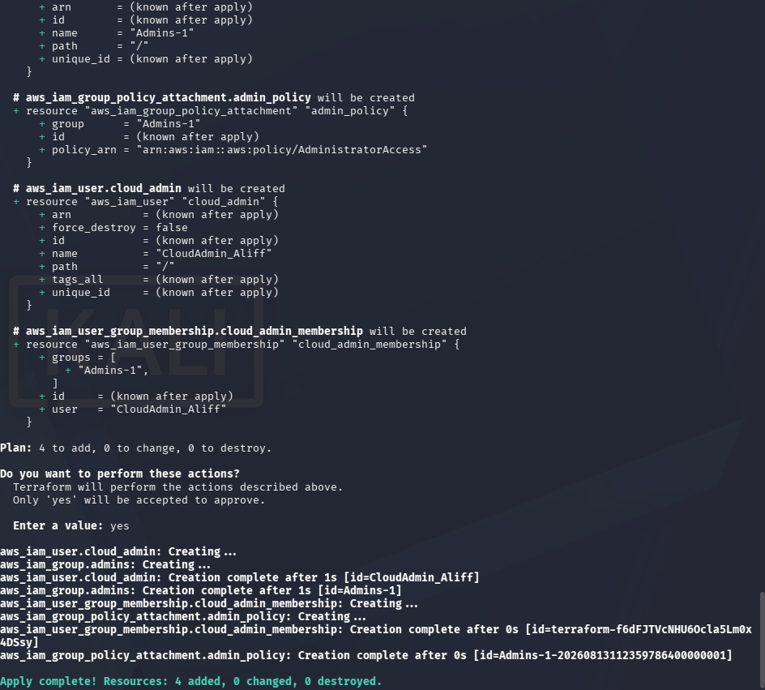

**Status:** Complete.

### Step 11: Verify independently with the AWS CLI

LocalStack requires AWS-shaped environment variables. Their values are intentionally hidden in this report:

```bash
export AWS_ACCESS_KEY_ID="[REDACTED]"
export AWS_SECRET_ACCESS_KEY="[REDACTED]"
export AWS_DEFAULT_REGION="us-east-1"
```

#### Verification A: Group membership

```bash
aws --endpoint-url=http://localhost:4566 iam get-group \
  --group-name Admins-1
```

The response contains `UserName: CloudAdmin_Aliff` and `GroupName: Admins-1`, proving that the user is a member of the required group.

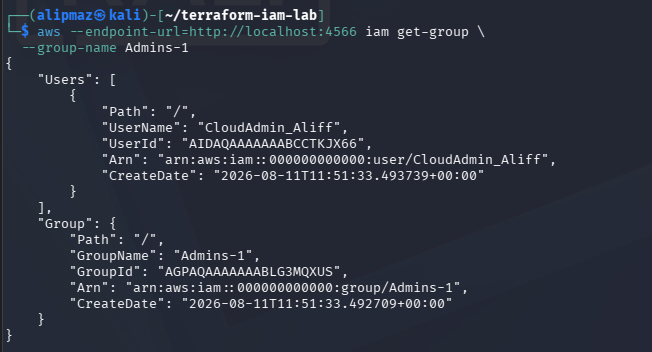

#### Verification B: Attached group policy

```bash
aws --endpoint-url=http://localhost:4566 iam list-attached-group-policies \
  --group-name Admins-1
```

The redacted evidence contains `PolicyName: AdministratorAccess` and `PolicyArn: arn:aws:iam::aws:policy/AdministratorAccess`, proving that the AWS-managed policy is attached to the group.


**Status:** Complete. No usable credential or secret value is displayed in the evidence used by this report.

### Step 12: Prove idempotency

Terraform was planned again after deployment:

```bash
terraform plan
```

The output reports `No changes. Your infrastructure matches the configuration.` This proves idempotency: applying the same declared state again would not duplicate resources or make unnecessary changes.

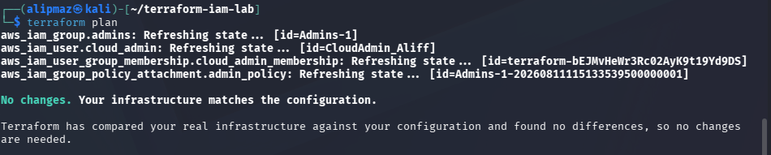

**Status:** Complete.

### Step 13: Destroy Terraform-managed resources

The Terraform-managed resources were destroyed after verification:

```bash
terraform destroy
# Confirmation entered: yes
```

The reviewed destruction plan shows `0 to add, 0 to change, 4 to destroy`.

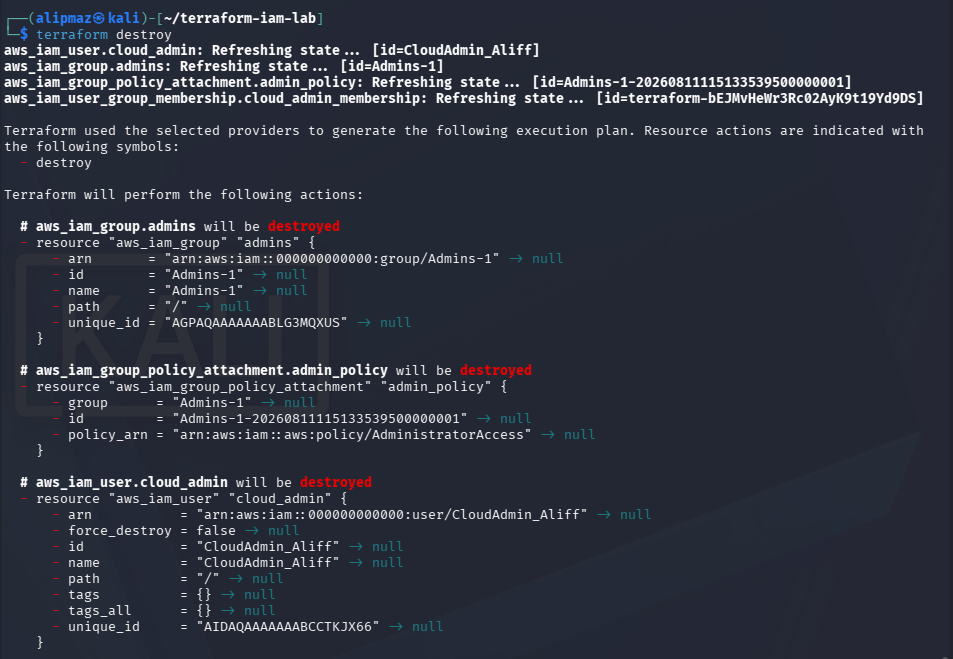

The final output reports `Destroy complete! Resources: 4 destroyed.`

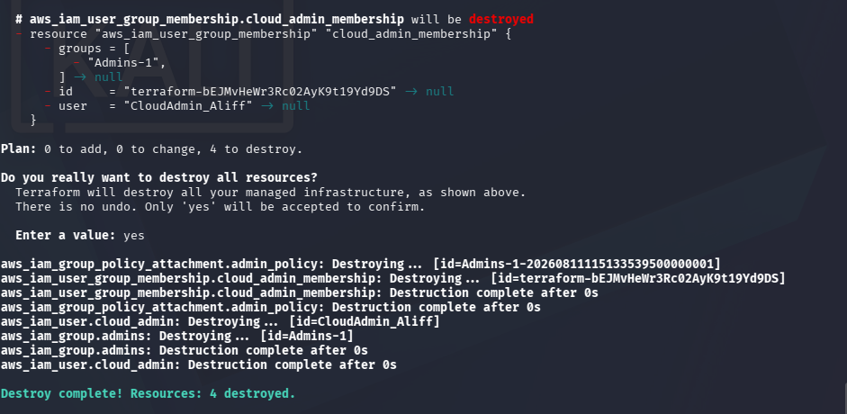

**Status:** Complete.

### Step 14: Stop and remove LocalStack

After Terraform finished destroying its resources, the named container was stopped and removed:

```bash
docker stop localstack
docker rm localstack
```

Both commands returned `localstack`, confirming successful cleanup.

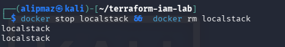

**Status:** Complete.

## Required Question and Answer

### Why is Terraform considered Infrastructure as Code, and what advantage does it provide compared with manual AWS CLI commands?

Terraform is considered Infrastructure as Code because infrastructure resources and their relationships are declared in a machine-readable configuration file that can be reviewed, reused, and version-controlled like software. Compared with repeating manual AWS CLI commands, Terraform produces more consistent and repeatable deployments, previews changes before applying them, records managed resources in state, detects differences between the desired and current state, avoids unnecessary changes through idempotency, and can recreate or safely destroy the same environment with fewer manual errors.

## Evidence and Deliverable Audit

| Requirement | Status | Evidence or action needed |
| --- | --- | --- |
| Terraform version | Complete | `09-terraform-version-recheck.png` |
| AWS CLI and Docker prerequisites | Complete | `10-prerequisites.png` |
| Auth Token loaded without disclosure | Complete | `11-localstack-start-healthy.png` |
| LocalStack healthy on port 4566 | Complete | `11-localstack-start-healthy.png` |
| Dedicated Terraform workspace | Partial | Later prompts show `~/terraform-iam-lab`; `ls -l` output is missing |
| Correct `main.tf` submission file | **Missing / correction required** | No `main.tf` is in this folder; the nearby Desktop copy says `CloudAdmin_Ainin` instead of `CloudAdmin_Aliff` |
| Full `main.tf` screenshot | Partial | `12-main-tf-configuration.png` shows endpoints and four resources, but not the start of the file |
| `terraform init` | Complete | `13-terraform-init.png` |
| `terraform fmt` and `terraform validate` | Complete | `14-terraform-fmt-validate.png` |
| Initial `terraform plan` | Complete | `15-terraform-plan.png` shows four additions |
| `terraform apply` | Complete | `16-terraform-apply-complete.png` shows four added |
| Group membership verification | Complete | `03-group-membership.png` |
| Attached policy verification | Complete and redacted | `18-cli-verification-redacted.png` |
| Second plan / idempotency | Complete | `05-idempotency.png` |
| `terraform destroy` | Complete | `07-destroy-plan.png` and `08-destroy-complete.png` |
| Stop and remove LocalStack | Complete | `17-localstack-stop-remove.png` |
| Required reflection answer | Complete | Answer provided above |

## Missing Items Before Submission

All required command-stage pictures are now present. Two source/workspace items still need attention:

1. Add the tested `main.tf` to the `terraform` submission folder and ensure the username is exactly `CloudAdmin_Aliff`. Do not submit the nearby `main.tf` unchanged because it currently says `CloudAdmin_Ainin`.
2. If the lecturer expects evidence for every guide step rather than only the formal submission checklist, capture `pwd` and `ls -l` from `~/terraform-iam-lab` to prove the workspace and source file location. A full-file view of `main.tf` would also be stronger than the current partial editor screenshot.

No new apply or destroy run is needed for the required command screenshots. If the correct tested `main.tf` cannot be recovered, recreate it from the censored structure above using the guide-provided LocalStack dummy values, run `terraform fmt` and `terraform validate`, and capture the workspace listing without exposing any token or credential.

## Conclusion

The evidence proves that Terraform created the four required LocalStack IAM resources, the user inherited administrator permissions through the group, AWS CLI verification matched the desired state, a second plan produced no changes, Terraform destroyed all four resources, and the LocalStack container was removed. The command workflow is complete. The submission is not fully ready only because the correct tested `main.tf` is absent from this folder and the nearby copy contains the wrong username; the workspace listing is also not pictured.
